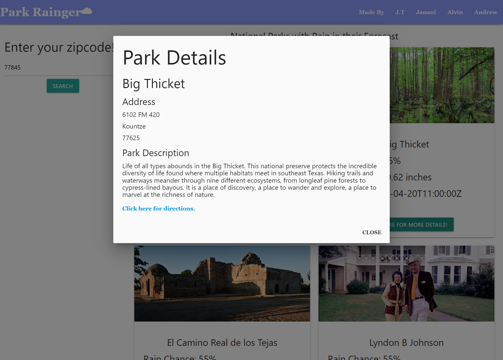

# README

## Description

This repository is made for the purpose of creating the Park Rainger App.  Search nearby National Parks with rain near any specified Zip Code!

## Other Contributors

A big thank you to Janani who has been a contributor since the beginning.  Her branches were the feature/index.html and feature/code-merge branches.

## Visuals

## Usage

Type in your Zip Code and click search.  Once your results pop up, you can click on the more details button for a modal containing the park name, address, description, and a link to directions.

## Technologies Used

HTML 5, CSS 3, Javascript ES6+

## Links

[Page Link](https://andrewvu71.github.io/Park-Rainger-App)

[Repository link (Github)](https://github.com/andrewvu71/Park-Rainger-App)

## License

Please refer to LICENSE in repository

## Credits

Google Maps API: \
https://developers.google.com/maps/ \
Geocoding API

US National Park Service API: \
https://www.nps.gov/subjects/developer/index.htm \
/parks API

Tomorrow.io: \
https://www.tomorrow.io/weather-api/ 

Materialize CSS \
https://materializecss.com/ \
v1.0.0
